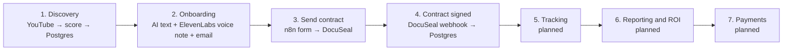
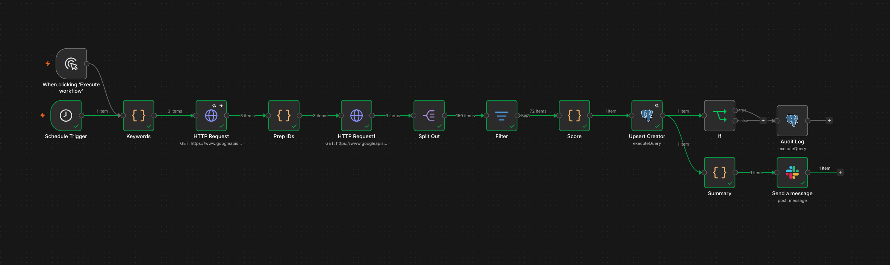
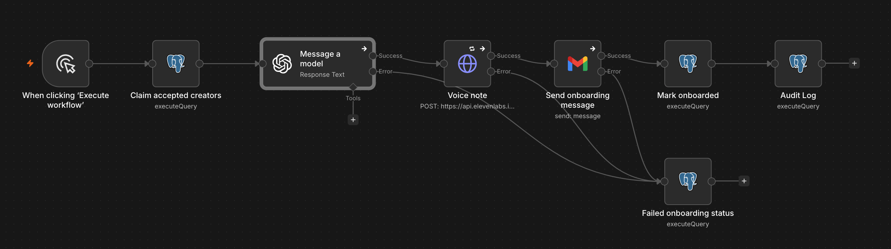
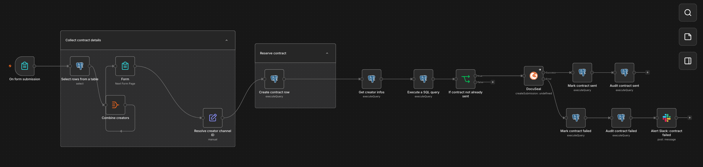
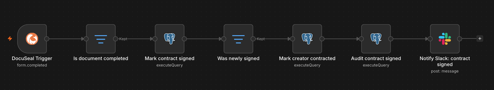
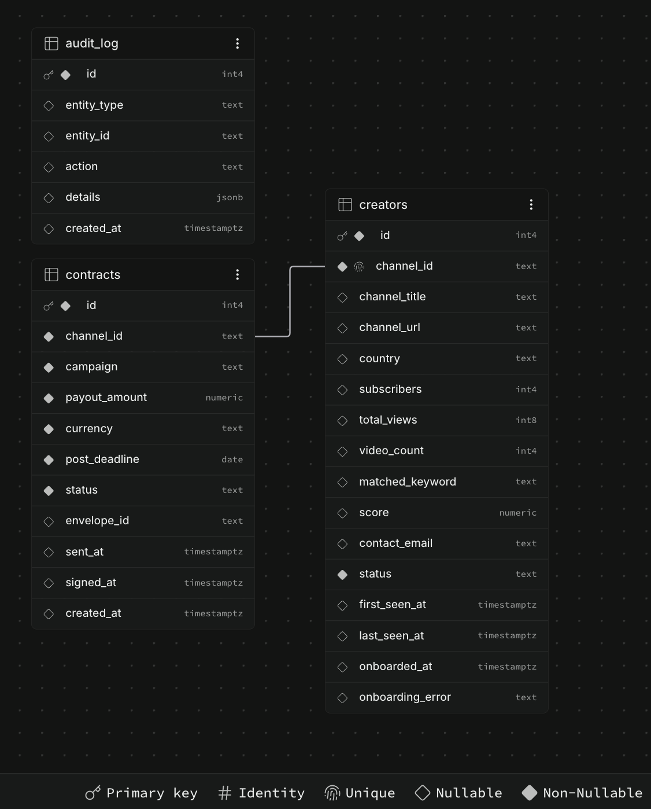

# Creator Ops Autopilot

> An automation layer for an influencer marketing program. It finds creators, onboards them with a personalized AI voice note, sends contracts for e-signature, and keeps the database in sync when they sign. Built with n8n, Postgres (Supabase), the YouTube Data API, ElevenLabs, DocuSeal and Slack.


▶️ **[Watch the 3-minute demo](https://www.loom.com/share/2d06f1d7bead478ea4eacb6537c36e38)

What you'll see: discovery with a zero-duplicates rerun, onboarding with the ElevenLabs voice note, a contract sent and signed, and a deliberate failure caught by the error branch and alerted in Slack.

---

## Why this project exists

Running a creator program with thousands of creators means a huge amount of repetitive work: finding people, onboarding them, writing contracts, chasing signatures, tracking posts, reporting results and paying invoices. A small team cannot do that by hand.

This repo is a working, small-scale version of the system that removes that manual work. It uses **fake contact emails and test accounts only**. No real creator is ever contacted.

The focus is **reliability, not just connecting boxes**: idempotent writes, atomic job claiming, retries, audit trails and failure alerts are built into every workflow.

---

## Pipeline at a glance



### Creator status lifecycle

```
discovered ──(manual approval)──► accepted ──► onboarding ──► onboarded ──► contracted
                                                   │
                                                   └──► onboarding_failed  (retryable)
```

### Contract status lifecycle

```
draft ──► sent ──► signed
  ▲         
  └─── failed  (re-submitting the form resets it to draft)
```

---

## Workflows

| # | Workflow | Trigger | What it does | Docs |
|---|----------|---------|--------------|------|
| 1 | **Creator Discovery** | Schedule + manual | Searches YouTube by keyword, filters by size and activity, scores channels, upserts them into Postgres, logs new ones and posts a Slack summary | [docs/creator-discovery-workflow.md](./docs/creator-discovery-workflow.md) |
| 2 | **Creator Onboarding** | Manual (schedule-ready) | Claims accepted creators, writes a short welcome message with an LLM, turns it into a voice note with ElevenLabs, emails it, and records the result | [docs/onboarding-workflow.md](./docs/onboarding-workflow.md) |
| 3 | **Send Contract** | n8n Form | Operator picks an onboarded creator and enters campaign, payout and deadline. Creates the contract row and sends a pre-filled DocuSeal template. Failures alert Slack | [docs/send-contract.md](./docs/send-contract-workflow.md) |
| 4 | **Contract Signed Webhook** | DocuSeal `form.completed` | Marks the contract `signed` and the creator `contracted`, writes an audit entry and notifies Slack | [docs/contract-signed-webhook.md](./docs/contract-signed-webhook.md) |

Importable exports are in [`workflows/`](workflows/).






---

## Reliability design decisions

These are the choices that make the workflows safe to re-run and easy to debug.

| Decision | Where | Why |
|----------|-------|-----|
| **Idempotent upsert** (`INSERT ... ON CONFLICT (channel_id) DO UPDATE`) | Discovery | Re-running the workflow creates 0 duplicates. `status` is never overwritten, so an accepted creator is never reset to `discovered` |
| **New vs updated detection** (`xmax = 0`) | Discovery | Only newly found creators get an audit row and count as "new" in the Slack summary |
| **Atomic job claiming** (`UPDATE ... FOR UPDATE SKIP LOCKED`) | Onboarding | Select and status change happen in one statement, so overlapping runs can never onboard the same creator twice |
| **Error branches, not silent failures** | Onboarding, Send Contract | A failed ElevenLabs call, email or DocuSeal request moves the record to a failed status, stores the error and (for contracts) alerts Slack |
| **Retryable failures** | Onboarding, Send Contract | Failed creators and contracts can be retried. `sent` and `signed` contracts are immutable |
| **Unique constraint on (channel_id, campaign)** | Send Contract | A double form submission cannot create two contracts |
| **Conditional updates** (`WHERE status = 'sent'`) | Contract Signed | A replayed or duplicate webhook updates 0 rows and stops, so there is no second audit entry or Slack message |
| **Audit log for every state change** | All | One `audit_log` table records entity, action and JSON details for every important event |
| **Parameterized SQL** | All | No string concatenation in queries |
| **Dropdown built from the database** | Send Contract | Only creators with `status = 'onboarded'` can receive a contract |

---

## Tech stack

| Layer | Tool |
|-------|------|
| Orchestration | n8n |
| Database | Postgres, hosted on Supabase (plain Postgres, runs anywhere) |
| Creator data | YouTube Data API v3 |
| AI text | OpenAI GPT-4.1 |
| Voice | ElevenLabs Text-to-Speech (`eleven_multilingual_v2`) |
| Email | Gmail (OAuth2) |
| E-signature | DocuSeal (n8n community node `@docuseal/n8n-nodes-docuseal`) |
| Alerts | Slack |

---

## Data model



Full SQL: [`db/schema.sql`](db/schema.sql).

| Table | Purpose | Key columns |
|-------|---------|-------------|
| `creators` | CRM of discovered creators | `channel_id` (unique), `subscribers`, `score`, `status`, `contact_email`, `onboarded_at`, `onboarding_error` |
| `contracts` | One contract per creator per campaign | `channel_id`, `campaign`, `payout_amount`, `post_deadline`, `status`, `envelope_id`, `sent_at`, `signed_at`, `UNIQUE (channel_id, campaign)` |
| `audit_log` | Append-only history of state changes | `entity_type`, `entity_id`, `action`, `details` (JSONB), `created_at` |

Example audit query:

```sql
SELECT created_at, entity_type, action, entity_id, details
FROM audit_log
ORDER BY created_at DESC
LIMIT 50;
```

---

## Setup

### 1. Database
Create a Postgres database (a free Supabase project works) and run `db/schema.sql` in the SQL editor.

When connecting n8n to Supabase, use the **Session pooler** connection details, not the direct host. The direct host is IPv6-only on the free tier and often unreachable from Docker.

### 2. n8n
Use n8n Cloud or self-host it. Install the community node `@docuseal/n8n-nodes-docuseal` for workflows 3 and 4.

### 3. Credentials (created in n8n, never committed)

| Credential | Used by |
|------------|---------|
| Postgres | All workflows |
| Slack OAuth2 | Discovery, Send Contract, Contract Signed |
| OpenAI API | Onboarding |
| ElevenLabs | Onboarding |
| Gmail OAuth2 | Onboarding |
| DocuSeal API | Send Contract, Contract Signed |

### 4. n8n Variables
Copy the names from [`.env.example`](.env.example) and set them under **Settings → Variables**.

| Variable | Purpose |
|----------|---------|
| `youtube_api_key` | YouTube Data API v3 key, read as `$vars.youtube_api_key` |

### 5. Import the workflows
Import each file in `workflows/`, assign your credentials, set your Slack channel, then test with the manual trigger.

### 6. Try it end to end
1. Run **Creator Discovery** and check the `creators` table.
2. In the table, change 2 or 3 rows from `discovered` to `accepted`.
3. Run **Creator Onboarding**. You should get the welcome email with the voice note.
4. Open the **Send Contract** form, pick the onboarded creator and submit.
5. Sign the DocuSeal email. Watch the contract become `signed`, the creator `contracted` and a Slack message appear.
6. Re-run steps 1 and 3, and replay the signed webhook. Nothing should be duplicated.

---

## Demo mode and safety

- Creator contact emails are **fake placeholders** (`creator+<id>@example.com`). The YouTube API does not provide contact emails, and scraping real people is out of scope.
- All outbound emails (welcome message and contract) go to a **single test inbox**, so the system cannot contact a real creator by accident. Switching to real recipients means changing the recipient expression in the Gmail and DocuSeal nodes.
- The company in the contract template is fictional. The template is a generic demo document, not legal advice. A real deployment would use the legal team's approved template.
- No secrets are stored in the workflow exports. Credentials are referenced by name only.

---

## Known limitations

- Creator approval (`discovered` → `accepted`) is a manual database edit. In production it would be a Slack approve button or a review form.
- Onboarding runs from a manual trigger. Replacing it with a Schedule Trigger is a one-node change.
- Discovery scoring is a simple proxy (average views per video, keyword match, size). It does not use recent-video engagement.
- Discovery is limited by the YouTube quota: `search.list` costs 100 units per call, so 3 keywords per day uses about 3% of the free 10,000 daily units.
- Tracking, reporting and payments are not built yet (see the roadmap).

---

## Scaling to thousands of creators

What I would change at higher volume:

- **Rate limits:** queue API calls and use batching with intervals. I hit a real `429` from an e-signature provider while building this, so backoff and batch intervals are not theoretical.
- **Quota:** cache channel lookups, use `playlistItems.list` (1 unit) for recent-video stats, and spread discovery across days.
- **Queueing:** run n8n in queue mode with workers. The `SKIP LOCKED` claim pattern already lets several workers share the same job table safely.
- **Heavy logic:** move scoring and report generation out of Code nodes into a small service or database functions.
- **Observability:** add a global error workflow, scheduled data-validation queries (duplicates, stuck `onboarding` rows, mismatched payouts) and a runbook.
- **Approvals and data:** replace manual approvals and fake emails with a review UI and a real contact-enrichment source.

---

## Roadmap

- [x] 1. Creator discovery (YouTube → score → Postgres → Slack summary)
- [x] 2. Onboarding (LLM welcome text + ElevenLabs voice note + email)
- [x] 3. Contract generation and e-signature (form → DocuSeal)
- [x] 4. Signed-contract webhook (status sync, audit, Slack)
- [ ] 5. Content reminders and live-link tracking
- [ ] 6. Metrics ingestion, ROI SQL view, weekly report and dashboard
- [ ] 7. Invoice routing and Stripe test payments with alerts
- [ ] 8. Global error workflow, scheduled validation queries, runbook

---

## Repository structure

```
creator-ops-autopilot/
├── README.md
├── .env.example
├── .gitignore
├── workflows/                    # n8n exports (credentials removed)
│   ├── 01-creator-discovery.json
│   ├── 02-creator-onboarding.json
│   ├── 03-send-contract.json
│   └── 04-contract-signed-webhook.json
├── db/
│   ├── schema.sql
│   └── data-model.png
└── docs/
    ├── workflows/                # one detailed README per workflow
    └── workflow-screenshots/
    └── contract_template.html
```

---

## How AI was used

AI helped throughout the build: drafting the architecture, SQL and Code-node logic, debugging errors from screenshots, and writing documentation. Inside the product itself, an LLM writes each creator's welcome message and ElevenLabs turns it into a voice note.

